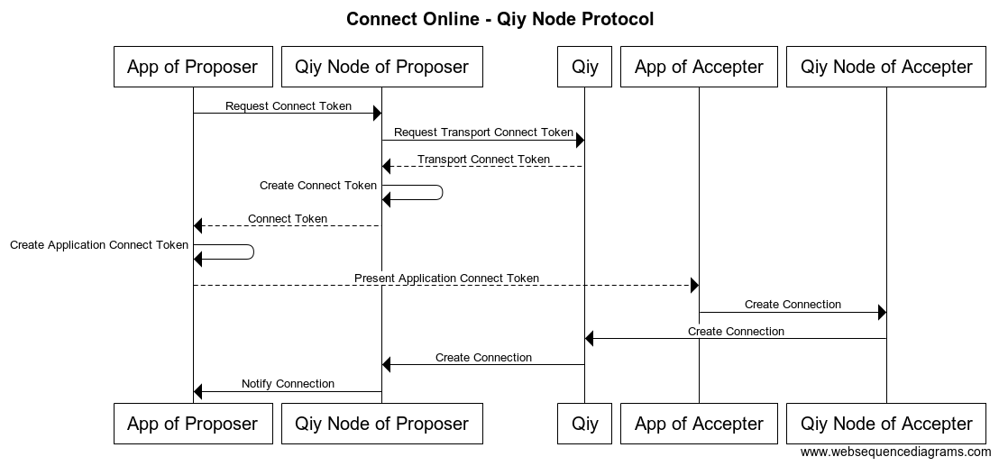
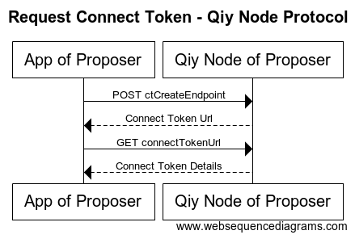
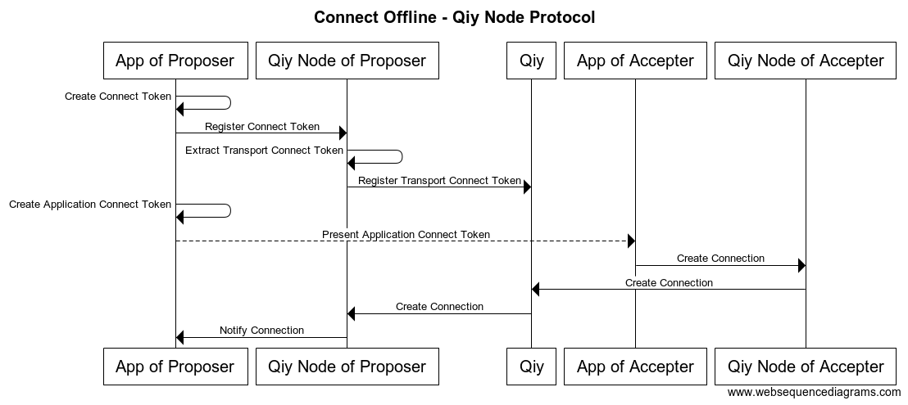
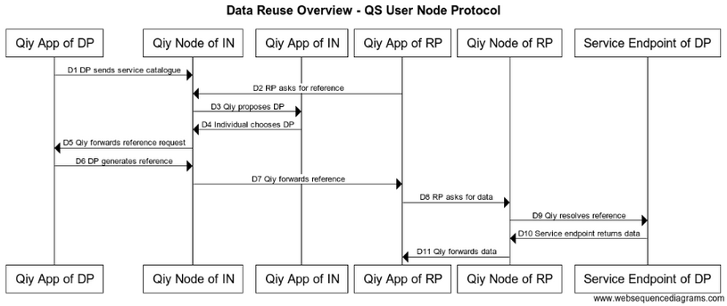

# QS User Node 

# Abstract

This document describes the [QS User Node](#qs-user-node): the [Qiy Node Implementation](Definitions.md#qiy-node-implementation) of [Digital Me](https://digital-me.nl).

# Contents

1. [Introduction](#1-introduction)
	1. [Purpose](#11-purpose)
	1. [Readers' Guidance](#12-readers-guidance)
	1. [Overview](#13-overview)
1. [QS User Node Application Service](#2-qs-user-node-application-service)
	1. [Service Desk](#21-service-desk)
	1. [Open API Specification](#22-open-api-specification)
	1. [QS User Node Servers](#23-qs-user-node-servers)
		1. [Access Check](#231-access-check)
	1. [Versions](#24-versions)
	1. [Dynamic Path Endpoint Addresses](#25-dynamic-path-endpoint-addresses)
	1. [Registration of Data Providers and/or Relying Parties](#26-registration-of-data-providers-andor-relying-parties)
1. [Lifecycle](#3-lifecycle)
	1. [Create Qiy Node](#31-create-qiy-node)
		1. [Transport Password](#311-transport-password)
		1. [Example request](#312-example-request)
	1. [Delete Qiy Node](#32-delete-qiy-node)
		1. [Example request](#321-example-request)
1. [Authentication](#4-authentication)
	1. [Java](#41-java)
	1. [Python](#42-python)
1. [Events](#5-events)
	1. [Example Event Stream](#51-example-event-stream)
1. [Connect](#6-connect)
	1. [Qiy App Requests Connect Token](#61-qiy-app-requests-connect-token)
	1. [Qiy App Creates Connection](#62-qiy-app-creates-connection)
	1. [Qiy Node Events](#63-qiy-node-events)
		1. [Proposer Events](#631-proposer-events)
			1. [First Time](#6311-first-time)
			1. [Next Times](#6312-next-times)
		1. [Accepter Events](#632-accepter-events)
			1. [First Time](#6321-first-time)
			1. [Next Times](#6322-next-times)
	1. [Connect Offline](#64-connect-offline)
	1. [Connections Request](#65-connections-request)
		1. [Example Connections Request](#651-example-connections-request)
1. [Messaging](#7-messaging)
	1. [Send Message](#71-send-message)
	1. [Transmit Message](#72-transmit-message)
	1. [Receive Message](#73-receive-message)
1. [Data Reuse](#8-data-reuse)
	1. [Main Flow](#81-main-flow)
		1. [Preconditons](#811-preconditons)
		1. [D1 Qiy App of Data Provider Provides Service Catalogue](#812-d1-qiy-app-of-data-provider-provides-service-catalogue)
		1. [D2 Qiy App of Relying Party Asks for Reference](#813-d2-qiy-app-of-relying-party-asks-for-reference)
		1. [D3 Qiy Node of Individual Proposes Data Provider](#814-d3-qiy-node-of-individual-proposes-data-provider)
		1. [D4 Individual chooses Data Provider](#815-d4-individual-chooses-data-provider)
		1. [D5 Qiy Node of Individual Forwards Reference Request](#816-d5-qiy-node-of-individual-forwards-reference-request)
		1. [D6 Qiy App of Data Provider Generates Reference](#817-d6-qiy-app-of-data-provider-generates-reference)
		1. [D7 Qiy Node of Individual Forwards Reference](#818-d7-qiy-node-of-individual-forwards-reference)
		1. [D8 Qiy App of Relying Party Asks for Data](#819-d8-qiy-app-of-relying-party-asks-for-data)
		1. [D9 Qiy Node of Relying Party Resolves Reference](#8110-d9-qiy-node-of-relying-party-resolves-reference)
		1. [D10 Service Endpoint Returns Data](#8111-d10-service-endpoint-returns-data)
		1. [D11 Qiy Node of Relying Party Forwards the Data](#8112-d11-qiy-node-of-relying-party-forwards-the-data)
	1. [Setup](#82-setup)
		1. [Individual and Relying Party Connect](#821-individual-and-relying-party-connect)
		1. [Individual and Data Provider Connect](#822-individual-and-data-provider-connect)
		1. [Data Provider Enrolls Individual](#823-data-provider-enrolls-individual)
	1. [No Data Provider](#83-no-data-provider)
		1. [Observed Behaviour](#observed-behaviour)
		1. [Expected Behaviour](#expected-behaviour)
	1. [Data Reference Request Sent Twice](#831-data-reference-request-sent-twice)
		1. [Observed Behaviour](#observed-behaviour)
		1. [Expected Behaviour](#expected-behaviour)
		1. [More then one Data Provider](#84-more-then-one-data-provider)
		1. [Data Reference Expired](#85-data-reference-expired)
		1. [Data Provider Connection Deleted](#86-data-provider-connection-deleted)
1. [Data Descriptions](#9-data-descriptions)
	1. [Test Data](#91-test-data)
1. [Index](#10-index)
	1. [Authorization Header Parameter](#authorization-header-parameter)
	1. [Connect Token](#connect-token)
	1. [Connect Token Create Request](#connect-token-create-request)
	1. [Connect Token Register Request](#connect-token-register-request)
	1. [Connection Create Request](#connection-create-request)
	1. [Connection Details Request](#connection-details-request)
	1. [Connections Request](#connections-request)
	1. [Data Provider](#data-provider)
	1. [Data Reference](#data-reference)
	1. [Data Reference Request](#data-reference-request)
	1. [Dynamic Path Endpoint Addresses](#dynamic-path-endpoint-addresses)
	1. [Events](#events)
	1. [Events Request](#events-request)
	1. [Message Post Request](#message-post-request)
	1. [Messages Request](#messages-request)
	1. [Operate Request](#operate-request)
	1. [Operation Execute Request](#operation-execute-request)
	1. [Operation Reference Message](#operation-reference-message)
	1. [Operation Reference Received Event](#operation-reference-received-event)
	1. [Operation Reference Request](#operation-reference-request)
	1. [Operation Reference Request Event](#operation-reference-request-event)
	1. [Operation Reference Request Message](#operation-reference-request-message)
	1. [Operation Register Request](#operation-register-request)
	1. [Operation Specification](#operation-specification)
	1. [Persistent Id](#persistent-id)
	1. [Persistent Id Event](#persistent-id-event)
	1. [Qiy Node](#qiy-node)
	1. [Qiy Node Create Request](#qiy-node-create-request)
	1. [Qiy Node Delete Request](#qiy-node-delete-request)
	1. [Qiy Node Message](#qiy-node-message)
	1. [Qiy App](#qiy-app)
	1. [QS User Node](#qs-user-node)
	1. [Relying Party](#relying-party)
	1. [Service Catalogue](#service-catalogue)
	1. [Service Catalogue Event](#service-catalogue-event)
	1. [Service Catalogue Message](#service-catalogue-message)
	1. [Service Catalogue Replace Request](#service-catalogue-replace-request)
	1. [Service Catalogue Request](#service-catalogue-request)
	1. [Service Desk](#service-desk)
	1. [Service Endpoint](#service-endpoint)
	1. [Source Candidates Event](#source-candidates-event)
	1. [Source Register Request](#source-register-request)
	1. [State Handled Event](#state-handled-event)
	1. [Transport Layer](#transport-layer)
	1. [Transport Protocol](#transport-protocol)
	1. [Transport Password](#transport-password)
1. [Diagram sources](#11-diagram-sources)
	1. [Connect](#111-connect)
		1. [Connect Online](#1111-connect-online)
		1. [Connect Offline](#1112-connect-offline)
		1. [Request Connect Token](#1113-request-connect-token)
	1. [Data Reuse Overview](#112-data-reuse-overview)

# 1 Introduction

## 1.1 Purpose

This document is the entry point for information analysts, service managers, software engineers and systems engineers that need to kow how they can use the [QS User Node](#qs-user-node).

## 1.2 Readers' Guidance

* Information analysts are advised to read all but [2 QS User Node Application Service](#2-qs-user-node-application-service).
* Software engineers are advised to read the complete document.
* Systems engineers are advised to read the [2 QS User Node Application Service](#2-qs-user-node-application-service). 
* Service managers are advised to read the [2 QS User Node Application Service](#2-qs-user-node-application-service). 

## 1.3 Overview

* [2 QS User Node Application Service](#2-qs-user-node-application-service) describes the [QS User Node](#qs-user-node) as an [Application Service](Definitions.md#application-service) provided by Digital Me.

Most of the remaining chapters describe the [Application Interface](Definitions.md#application-interface) of the [QS User Node](#qs-user-node):
* [3 Lifecycle](#3-lifecycle) describes how [QS User Node](#qs-user-node) can be used to manage Qiy Nodes throughout their lifecycles.
* [4 Authentication](#4-authentication) describes how requests can be authenticated.
* [5 Events](#5-events) is dedicated to working with events.
* [6 Connect](#6-connect) describes how one can create [Connections](Definitions.md#connection).
* [7 Messaging](#7-messaging) describes the messaging mechanism.
* [8 Data Reuse](#8-data-reuse) describes how data can be reused.

The last chapters are:
* [9 Data Descriptions](#9-data-descriptions) contains an example data description.
* [10 Index](#10-index) contains an index for the terms used in the [QS User Node](#qs-user-node) documentation.
* [11 Diagram sources](#11-diagram-sources) contains the source code for the sequence diagrams in this document.

# 2 QS User Node Application Service

This chapter describes the QS User Node Application Service provided by Digital Me.

## 2.1 Service Desk

Please contact the [Service Desk](#service-desk) for your requests.
The Service Desk is available during regular office hours and can be contacted by e-mail or phone:
* service@digital-me.nl
* +31 (0) 411-616565

## 2.2 Open API Specification

The QS User Node API is available in [Open API Specification](https://swagger.io/specification/) format and can be viewed with an online editor at: [https://editor2.swagger.io/#!/](https://editor2.swagger.io/#!/). To view the api, use the menu ('File' -> 'Import URL...' or 'Import File...') and the following url/file:

[https://raw.githubusercontent.com/digital-me/qiy-node/topic/data-reuse/qs-user-node-api.json](https://raw.githubusercontent.com/digital-me/qiy-node/topic/data-reuse/qs-user-node-api.json)


## 2.3 QS User Node Servers

The following QS User Node Servers are available:

Environment | [Server Url](https://swagger.io/specification/#serverObject)
----------- | ----
Acceptance | https://user.dolden.net/user
Dev2       | https://dev2-user.testonly.digital-me.nl/user


### 2.3.1 Access Check

Access to a server can be checked with the following http request:

GET /api

Please try for yourself:
* Acceptance Check: https://user.dolden.net/user/api
* Dev2 Check: https://dev2-user.testonly.digital-me.nl/user/api

## 2.4 Versions

The QS User Node specifications are versioned using [Semantic Versioning 2.0.0](https://semver.org/spec/v2.0.0.html) (semver) and follows the semver specification.
In addition, Digital Me follows these rules:
1. Digital Me supports two major versions in the production environment: one primary version and one secundary version.
2. Digital Me will support a secundary version for at least 6 months.
2. Digital Me supports one development version in the development environment.
3. A development version is used for development and may change at any time.

## 2.5 Dynamic Path Endpoint Addresses

The QS User Node uses [Dynamic Path Endpoint Addresses](#dynamic-path-endpoint-addresses) for all but the /api path endpoint, which is strongly advised to be used at the start of every new day to obtain valid addresses and remain operational.

## 2.6 Registration of Data Providers and/or Relying Parties

Please contact the [Service Desk](#service-desk) to register as a Data Provider and/or a Relying Party and obtain the credentials to access to Qiy.

# 3 Lifecycle

This chapter describes the QS User Node support for Qiy Node Lifecycle processes.

## 3.1 Create Qiy Node

A Qiy Node can be created with a [Qiy Node Create Request](#qiy-node-create-request).

### 3.1.1 Transport Password
Creation of a Qiy Node requires providing a [Transport Password](#transport-password) : this password is mandatory for transport-related requests.

### 3.1.2 Example request

```
Request:
POST https://dev2-user.testonly.digital-me.nl/user/owners HTTP/1.1


Connection: keep-alive
Accept-Encoding: gzip, deflate
Accept: application/json
User-Agent: python-requests/2.18.4
Content-Type: application/json
Content-Length: 530


{"alias": "pt_usernode_qnc_test_de", "id": "pt_usernode_qnc_test_de", "publicKey": "MIIBIjANBgkqhkiG9w0BAQEFAAOCAQ8AMIIBCgKCAQEA0TK8dMRxvXp66teemQe/tzUi26LBWfkO0pWGqyzmnNO6ISALt+rgEPl5mhqztAU4xI9iE/L9dCzC3snb2OQT+2/IaV9ilt1UAmZhyuogPeTKykPRFR2oT51wWoIuG4hD0x6iBhFCorn087Te99oS1RwS1RR5wFjIs/ol3ldawZ29xemsskmPEWJ/QpfpauBxvSbZEXRy15cAWnWO9yVzizUszwNjP8Ca0/K7NKa+lOtp09egO12SBMfX871AI44wWkZqPsr+O5cpo8Srw+90dbETA1Ypno3lpel2lBMQaf0+Srmjd/bJs9dlaXCTljoLt2uvOmriDSI6eSJZ7FxH4wIDAQAB", "password": "9b449623-f361-425b-bca8-8c23c159e4c0"}


Response:
201
Date: Mon, 19 Feb 2018 14:55:29 GMT
tracker: USR-100593
Location: https://dev2-user.testonly.digital-me.nl/user/owners/id/pt_usernode_qnc_test_de
Link: <https://dev2-user.testonly.digital-me.nl/user/owners/id/pt_usernode_qnc_test_de>; rel="delete"
Content-Length: 0
Strict-Transport-Security: max-age=15768000;includeSubDomains
X-XSS-Protection: 1; mode=block
X-Content-Type-Options: nosniff
Access-Control-Allow-Headers: Cache-Control, Pragma, Origin, Authorization, Content-Type, X-Requested-With, Set-Cookie, Cookie, Accept, password
Access-Control-Expose-Headers: Location
Access-Control-Allow-Methods: GET, PUT, POST, OPTIONS, DELETE
Access-Control-Allow-Origin: *
Access-Control-Allow-Credentials: true
Connection: close
Content-Type: text/plain; charset=UTF-8

```
## 3.2 Delete Qiy Node

A Qiy Node can be deleted with a [Qiy Node Delete Request](#qiy-node-delete-request).

### 3.2.1 Example request

```
Request:
DELETE https://dev2-user.testonly.digital-me.nl/user/owners/id/pt_usernode_qnc_test_de HTTP/1.1


Accept: application/json
Accept-Encoding: gzip, deflate
User-Agent: python-requests/2.18.4
Connection: keep-alive
content-type: application/json
Authorization: QTF pt_usernode_qnc_test_de 1519064940667:qtLYGGLWtsBELt9YWh/MBwqofyMNiTzUZypYeA+VjbOWt6LWdG1Fp3xZHlfPHADZUlBgvyWGyirCEqg8qBYiJXJsXaZDz5t+qQSZx0Euod7aMaSDPIUqeicujiKJAQLEyQYb5g9nJFXswKus6gq1DlXU807eGLkf8LYMrRMLijLcXnSbu7iW0ZZgnNwVS3+9NOTBLTwhy166DO7Th7IGz/4FxWq7ba90Hhp24PzYvskaC8FCEj1iNs4T8uu6KWvazN3xZL40WLUFK9m5FjJP4epaCwjqJSOtmhovqkEu++ML3K7Us5rPM9toshPZwut5VYEJFkMBSMsoTK5xdz7Qrw==
Content-Length: 0


None


Response:
204
Date: Mon, 19 Feb 2018 18:29:00 GMT
tracker: USR-100800
Strict-Transport-Security: max-age=15768000;includeSubDomains
X-XSS-Protection: 1; mode=block
X-Content-Type-Options: nosniff
Access-Control-Allow-Headers: Cache-Control, Pragma, Origin, Authorization, Content-Type, X-Requested-With, Set-Cookie, Cookie, Accept, password
Access-Control-Expose-Headers: Location
Access-Control-Allow-Methods: GET, PUT, POST, OPTIONS, DELETE
Access-Control-Allow-Origin: *
Access-Control-Allow-Credentials: true
Connection: close
Content-Type: text/plain; charset=UTF-8
```

# 4 Authentication

Most requests must be authenticated using the [Authorization Header Parameter](#authorization-header-parameter) containing a signature over the Qiy Node Id, the current Unix time in ms using a Private Key which is unique for the Qiy Node.

## 4.1 Java

In Java, the value of the Authorization header parameter can be calculated as follows:
```
public String signatureHeaderForData(String uuid, byte[] data) {
  String nonce = "" + System.currentTimeMillis();
  byte[] nonceBytes = nonce.getBytes(StandardCharsets.UTF_8);
  byte[] id = uuid.getBytes();
  PrivateKey pk = getKeyPair(uuid).getPrivate();

  Signature sig = Signature.getInstance("SHA256withRSA", "SunRsaSign");
  sig.initSign(pk);
  sig.update(id, 0, id.length);
  sig.update(nonceBytes, 0, nonceBytes.length);
  if (data != null) {
	sig.update(data, 0, data.length);
  }
  byte[] signature = sig.sign();

  String result = Base64.getEncoder().encodeToString(signature);
  return String.format("QTF %s %s:%s", uuid, nonce, result);
}
````

## 4.2 Python

In Python, the value of the Authorization header parameter can be calculated as follows:

```
from OpenSSL.crypto import sign
from base64 import b64encode
import OpenSSL

def authHeader(uuid, nonce, Input):
        tosign="{0}{1}{2}".format(uuid,nonce,Input)
        print("tosign: '{0}'".format(tosign))
        with open(<File with private key in pem format>,"r") as f:
                buffer=f.read()
        key=OpenSSL.crypto.load_privatekey(OpenSSL.crypto.FILETYPE_PEM,buffer)
        signature=b64encode(sign(
                key
                ,tosign
                ,"sha256")
                ).decode()
        return "QTF {0} {1}:{2}".format(uuid, nonce, signature)
```

# 5 Events

A Qiy Application can use the [Events Request](#events-request) to start listening to the [Events](#events) generated by its Qiy Node.
The Events comply to the [Server-Sent Events Standard](https://developer.mozilla.org/en-US/docs/Web/API/Server-sent_events/Using_server-sent_events).


## 5.1 Example Event Stream

```
'{"type":"CONNECTED_TO_ROUTER",
"connectionUrl":"https://dev2-user.testonly.digital-me.nl/user/connections/user/pt_usernode_B/03361f35-3334-481c-8cc2-01f9bb759b4a",
"extraData":"https://dev2-issuer.testonly.digital-me.nl/issuer/routes/webhook/ff937f9a-b520-40e0-82d6-261b31633ac9"}'

'{"type":"SHARED_SECRET_RECEIVED",
"connectionUrl":"https://dev2-user.testonly.digital-me.nl/user/connections/user/pt_usernode_B/03361f35-3334-481c-8cc2-01f9bb759b4a",
"extraData":null}'

'{"type":"STATE_HANDLED",
"connectionUrl":"https://dev2-user.testonly.digital-me.nl/user/connections/user/pt_usernode_B/03361f35-3334-481c-8cc2-01f9bb759b4a",
"extraData":"https://dev2-user.testonly.digital-me.nl/user/connections/user/pt_usernode_B/03361f35-3334-481c-8cc2-01f9bb759b4a"}'
```


# 6 Connect

This chapter describes the interactions of two connecting Qiy Nodes. 



(Diagram source code: [11.1.1 Connect Online](#1111-connect-online))

## 6.1 Qiy App Requests Connect Token

A Qiy App can acquire a Connect Token from a Qiy Node using two calls, 
see [Connect Token Create Request](#connect-token-create-request) for more information.



(Diagram source code: [11.1.3 Request Connect Token](#1113-request-connect-token))

## 6.2 Qiy App Creates Connection

Use [Connection Create Request](#connection-create-request).

When the Connection is established, the Qiy Node of the Qiy App receives a [Service Catalogue Message](#service-catalogue-message), like the one below.

## 6.3 Qiy Node Events

This section describes the connecting-related events.

### 6.3.1 Proposer Events

Every time that an Accepter uses a Connect Token to create a Connection, a new one is created, but only the first Connection can be used.
The Connection Url of this Connection is always passed in the 'extraData'-field of the [State Handled Event](#state-handled-event).

#### 6.3.1.1 First Time

```
'{"type":"CONNECTED_TO_ROUTER",
"connectionUrl":"https://dev2-user.testonly.digital-me.nl/user/connections/user/pt_usernode_B/03361f35-3334-481c-8cc2-01f9bb759b4a",
"extraData":"https://dev2-issuer.testonly.digital-me.nl/issuer/routes/webhook/ff937f9a-b520-40e0-82d6-261b31633ac9"}'

'{"type":"SHARED_SECRET_RECEIVED",
"connectionUrl":"https://dev2-user.testonly.digital-me.nl/user/connections/user/pt_usernode_B/03361f35-3334-481c-8cc2-01f9bb759b4a",
"extraData":null}'

'{"type":"STATE_HANDLED",
"connectionUrl":"https://dev2-user.testonly.digital-me.nl/user/connections/user/pt_usernode_B/03361f35-3334-481c-8cc2-01f9bb759b4a",
"extraData":"https://dev2-user.testonly.digital-me.nl/user/connections/user/pt_usernode_B/03361f35-3334-481c-8cc2-01f9bb759b4a"}'
```

#### 6.3.1.2 Next Times

```
{"type":"CONNECTED_TO_ROUTER",
"connectionUrl":"https://dev2-user.testonly.digital-me.nl/user/connections/user/pt_usernode_B/958ffeb0-d1bf-4b74-86b1-6fa98c618e66",
"extraData":"https://dev2-issuer.testonly.digital-me.nl/issuer/routes/webhook/69da9eae-8e00-41d1-8497-a21644de4907"}

{"type":"STATE_HANDLED",
"connectionUrl":"https://dev2-user.testonly.digital-me.nl/user/connections/user/pt_usernode_B/958ffeb0-d1bf-4b74-86b1-6fa98c618e66",
"extraData":"https://dev2-user.testonly.digital-me.nl/user/connections/user/pt_usernode_B/03361f35-3334-481c-8cc2-01f9bb759b4a"}
```

### 6.3.2 Accepter Events

Every time that an Accepter uses a Connect Token to create a Connection, a new one is created, but only the first Connection can be used.
When an Accepter already has a Connection with the Proposer, the Connection Url of this Connection is passed in the 'new-uri'-field of the 'extraData'-field of the [Persistent Id Event](#persistent-id-event).
The [Persistent Id](#persistent-id) is always fired and returns the [Persistent Id](#persistent-id):
* The [Persistent Id](#persistent-id) can be used to uniquely identify a connected Qiy Node.
* The [Persistent Id](#persistent-id) for two connected Qiy Nodes is always the same.


#### 6.3.2.1 First Time

```
'{"type":"CONNECTED_TO_ROUTER",
"connectionUrl":"https://dev2-user.testonly.digital-me.nl/user/connections/user/pt_usernode_A/bf342b76-5396-48ef-8ccc-43b103a9caef",
"extraData":null}'

'{"type":"PID",
"connectionUrl":"https://dev2-user.testonly.digital-me.nl/user/connections/user/pt_usernode_A/bf342b76-5396-48ef-8ccc-43b103a9caef",
"extraData":{"pid":"eAkgIOI0K5kRGHsgc65LAQ=="}}'

'{"type":"SHARED_SECRET_SENT",
"connectionUrl":"https://dev2-user.testonly.digital-me.nl/user/connections/user/pt_usernode_A/bf342b76-5396-48ef-8ccc-43b103a9caef",
"extraData":null}'
```

#### 6.3.2.2 Next Times

```
{"type":"CONNECTED_TO_ROUTER",
"connectionUrl":"https://dev2-user.testonly.digital-me.nl/user/connections/user/pt_usernode_A/264ab068-3adf-4eb3-bcdd-7800380126d1",
"extraData":null}

{"type":"PID",
"connectionUrl":"https://dev2-user.testonly.digital-me.nl/user/connections/user/pt_usernode_A/264ab068-3adf-4eb3-bcdd-7800380126d1",
"extraData":{
    "new-uri":"https://dev2-user.testonly.digital-me.nl/user/connections/user/bf342b76-5396-48ef-8ccc-43b103a9caef/bf342b76-5396-48ef-8ccc-43b103a9caef",
    "pid":"eAkgIOI0K5kRGHsgc65LAQ=="}}
```

## 6.4 Connect Offline

An Accepter can also initiate a Connection when Qiy is temporarily not available by generating a Connect Token and registering it later using a [Connect Token Register Request](#connect-token-register-request) when the access has been restored.



(Diagram source code: [11.1.2 Connect Offline](#1112-connect-offline))

## 6.5 Connections Request

Information of the connections can be acquired using the [Connections Request](#connections-request).

### 6.5.1 Example Connections Request

```
Request:
GET http://127.0.0.1:8087/user/connections/user/pt_usernode_dr_dp_lo HTTP/1.1


User-Agent: python-requests/2.18.4
Accept: */*
Connection: keep-alive
Accept-Encoding: gzip, deflate
Authorization: QTF pt_usernode_dr_dp_lo 1521728878364:nNNvY8BxY0LucrOFOCBgg7s0GMaO9z+883CQEyMTvTvxUYlsN4OvA18tchuplVT9nmN4btD4NXAntqBkrGzey/fdyYrz6DmYSkB1d63/guXwLXhcwW0oI3JRIrCFcVwkCzAQ0uy3ppg979acz1Q8EMcQo9P5p06rRFlp1KEZ0HMPjHTW8ox60JAVHh+mc7h38g4RtQ2kLl5MiQfc66qa3EXF5Qf35CV4QL7phmozZzb/FafscpHdriY8oGGzYJa8M2YQdtc9Ql467c3A9U5Ab9rxxGEAdkh1Tts0Le05mk2ryAV7ao2+FOgwJEmahrcLwzqrCKnkm5wiwwWXaXOZYw==


None


Response:
200
Date: Thu, 22 Mar 2018 14:27:58 GMT
tracker: USR-102315
Content-Type: application/json
Vary: Accept-Encoding
Content-Encoding: gzip
Content-Length: 215


{"result":[{"state":"connected","activeFrom":1521728877000,"activeUntil":null,"links":{"self":"http://127.0.0.1:8087/user/connections/user/pt_usernode_dr_dp_lo/22452909-c659-418e-bf63-53175643e886","references":"http://127.0.0.1:8087/user/references/pt_usernode_dr_dp_lo/22452909-c659-418e-bf63-53175643e886","mbox":"http://127.0.0.1:8087/user/mbox/user/pt_usernode_dr_dp_lo/22452909-c659-418e-bf63-53175643e886"}}],"links":null}
```


# 7 Messaging

This chapter describes the transmission of [Qiy Node Messages](#qiy-node-message) between two Qiy Apps over the Connection between their Qiy Nodes.

## 7.1 Send Message

A [Qiy App](#qiy-app) can send a [Qiy Node Message](#qiy-node-message) over a Connection using its Connction Url as follows:
1. The [Qiy App](#qiy-app) uses the Connection Url in a [Connection Details Request](#connection-details-request) to acquire the Mbox Url of the Connection.
2. The [Qiy App](#qiy-app) uses the Mbox Url in a [Message Post Request](#message-post-request) to send the message.

## 7.2 Transmit Message

A [Qiy Node](#qiy-node) transmits a [Qiy Node Message](#qiy-node-message) over a Connection with the help of the [Transport Layer](#transport-layer). For more information, see [Transport Protocol](#transport-protocol).

## 7.3 Receive Message

A [Qiy App](#qiy-app) can receive [Qiy Node Messages](#qiy-node-message) using the [Messages Request](#messages-request).


# 8 Data Reuse

This chapter describes the use case for data reuse.
* [8.1 Main Flow](#81-main-flow) describes the main flow.
* [8.2 Setup](#82-setup) describes the preparations for the main flow.
* [8.3 No Data Provider](#83-no-data-provider) and the remaining sections flesh out the alternate flows.




(Diagram source code: [11.2 Data Reuse Overview](#112-data-reuse-overview))


## 8.1 Main Flow

### 8.1.1 Preconditons

The preconditions for the scenario are:
1. The Data Provider has setup a [Service Endpoint](#service-endpoint) for the delivery of the data it can provide.
1. The Qiy Nodes of the Relying Party and the Individual have a Connection with eachother, see [8.2.1 Individual and Relying Party Connect](#821-individual-and-relying-party-connect).
1. The Qiy Nodes of the Individual and the Data Provider have a Connection with eachother, see [8.2.2 Individual and Data Provider Connect](#822-individual-and-data-provider-connect).
1. The Connections between the Qiy Nodes will remain for the duration of the scenario.
1. The Data Provider has enrolled the Individual, see [8.2.3 Data Provider Enrolls Individual](#823-data-provider-enrolls-individual).
1. The Relying Party requests Personal Data that the Data Provider can provide.
1. The Qiy Applications of the Relying Party, the Individual and the Data Provider are listening to the [Qiy Node Events](#qiy-node-event) and will do so for the duration of the scenario.

### 8.1.2 D1 Qiy App of Data Provider Provides Service Catalogue

The Qiy App of the Data Provider updates the [Service Catalogue](#service-catalogue) of the Data Provider using a [Service Catalogue Replace Request](#service-catalogue-replace-request) and the Qiy Node of the Individual receives the [Service Catalogue](#service-catalogue) in a [Service Catalogue Message](#service-catalogue-message). The change is also propagated to the App of the Individual in a [Service Catalogue Event](#service-catalogue-event).

### 8.1.3 D2 Qiy App of Relying Party Asks for Reference

The Qiy App of the Relying Party requests a [Data Reference](#data-reference) by sending an [Operation Reference Request Message](#operation-reference-request-message) over the Connection with the Individual, see [7.1 Send Message](#71-send-message).


### 8.1.4 D3 Qiy Node of Individual Proposes Data Provider

The Qiy Node of the Individual processes the [Operation Reference Request Message](#operation-reference-request-message):
1. The [Qiy Node](#qiy-node) finds the [Data Provider](#data-provider) that can provide the data.
1. The [Qiy Node](#qiy-node) forwards the request and the available [Data Provider](#data-provider) using a [Operation Reference Request Event](#operation-reference-request-event) to the Qiy App of the Idividual.

### 8.1.5 D4 Individual chooses Data Provider

The Individual reads the request for data and decides to grant it and approves the use of the proposed Data Provider which is communicated by the App of the Individual to the Qiy Node of the Individual with an [Operation Reference Request](#operation-reference-request).

### 8.1.6 D5 Qiy Node of Individual Forwards Reference Request

The Qiy Node of the Individual forwards the Operation Reference Request to the [Data Provider](#data-provider) using a [Operation Reference Request Message](#operation-reference-request-message).


### 8.1.7 D6 Qiy App of Data Provider Generates Reference

1. The Qiy App of the Data Provider generates an [Operation Specification](#operation-specification).
1. The Qiy App of the Data Provider registers the [Operation Specification](#operation-specification) using an [Operation Register Request](#operation-register-request).
1. The Qiy App of the Data Provider receives the Data Reference in the response of the [Operation Register Request](#operation-register-request).
1. The Qiy App of the Data Provider sends the Data Reference in an [Operation Reference Message](#operation-reference-message) to the Qiy Node of the Individual, see [7.1 Send Message](#71-send-message).

### 8.1.8 D7 Qiy Node of Individual Forwards Reference

1. The Qiy Node of the Individual processes the Data Reference; it looks up the related [Data Reference Request](#data-reference-request).
1. The Qiy Node of the Individual sends the Data Reference in an [Operation Reference Message](#operation-reference-message) to the sender of the [Data Reference Request](#data-reference-request): the [Relying Party](#relying-party), see [7.1 Send Message](#71-send-message).
1. The Qiy App of the Relying Party receives the Data Reference in an [Operation Reference Received Event](#operation-reference-received-event).

### 8.1.9 D8 Qiy App of Relying Party Asks for Data

The Qiy App of the Relying Party asks for the Data by using the Data Reference in an [Operation Execute Request](#operation-execute-request) to its Qiy Node.

### 8.1.10 D9 Qiy Node of Relying Party Resolves Reference

1. The Qiy Node of the Relying Party looks up the [Operation Specification](#operation-specification) for the given Data Reference and uses it to generate the [Operate Request](#operate-request).
1. The Qiy Node of the Relying Party sends the [Operate Request](#operate-request) to the [Service Endpoint](#service-endpoint).

### 8.1.11 D10 Service Endpoint Returns Data

The Service Endpoint processes the [Operate Request](#operate-request).
If the Service Endpoint processes the [Operate Request](#operate-request) succesfully, it returns the data to the Qiy Node of the Relying Party in the response of the request.

### 8.1.12 D11 Qiy Node of Relying Party Forwards the Data

The Qiy App of the Relying Party obtains the Data in the response of the [Operation Execute Request](#operation-execute-request) it issued earlier.
 

```
data = {
   "openstaande schuld": 53,40
}
```

## 8.2 Setup

### 8.2.1 Individual and Relying Party Connect

For information on how the Individual and Relying Party can connect, see [6 Connect](#6-connect).

### 8.2.2 Individual and Data Provider Connect

For information on how the Individual and Relying Party can connect, see [6 Connect](#6-connect).

### 8.2.3 Data Provider Enrolls Individual

The Data Provider can Enroll the Individual as follows:
1. Data Provider identifies and authenticates the Individual.
2. Data Provider persists relation between the local identity of the Individual and the Connection Url of the Connection with the Individual. 


## 8.3 No Data Provider

### Observed Behaviour

The flow stops when the Qiy Node of the Individual has received the Data Reference Request.

### Expected Behaviour

tbd

## 8.3.1 Data Reference Request Sent Twice

### Observed Behaviour

The second Data Reference Request is accepted.

### Expected Behaviour

tbd
### 8.4 More then one Data Provider

tbd

### 8.5 Data Reference Expired

Scenario:
1. The Qiy Node has a Connection with the Data Provider that generated the Data Reference.
1. The Qiy Node has received a valid Data Reference.

Steps:
1. tbd

### 8.6 Data Provider Connection Deleted

Scenario:
1. The Qiy Node does not have a Connection anymore with the Data Provider that generated the Data Reference.
1. The Qiy Node has received a valid Data Reference.

Steps:
1. tbd

# 9 Data Descriptions


## 9.1 Test Data

Example value:

```
data = {
   "openstaande schuld": 53,40
}
```

# 10 Index

## Authorization Header Parameter

Specification | Reference
------------- | ---------
[QS User Node](QS%20User%20Node.md) | [4 Authentication](#4-authentication)

## Connect Token

Specification | Reference
------------- | ---------
[Definitions](Definitions.md)                       | [Connect Token](Definitions.md#connect-token)
[QS User Node API](QS%20User%20Node%20API.json) | [Connect Token Model](http://htmlpreview.github.io/?https://github.com/digital-me/qiy-node/blob/topic/data-reuse/qs-user-node-api.html#ConnectTokenModel)

## Connect Token Create Request

Specification | Reference
------------- | ---------
[Definitions](Definitions.md)                       | [Connect Token Create Request](Definitions.md#connect-token-create-request)
[QS User Node API](QS%20User%20Node%20API.json) | [POST /ctCreateEndpoint](http://htmlpreview.github.io/?https://github.com/digital-me/qiy-node/blob/topic/data-reuse/qs-user-node-api.html#ctCreateEndpointPost)
[QS User Node API](QS%20User%20Node%20API.json) | [GET /connectTokenUrl](http://htmlpreview.github.io/?https://github.com/digital-me/qiy-node/blob/topic/data-reuse/qs-user-node-api.html#connectTokenUrlGet)
[QS User Node](QS%20User%20Node.md) | [6.1 Qiy App Requests Connect Token](#61-qiy-app-requests-connect-token)

## Connect Token Register Request

Specification | Reference
------------- | ---------
[Definitions](Definitions.md)                       | [Connect Token Register Request](Definitions.md#connect-token-register-request)
[QS User Node API](QS%20User%20Node%20API.json) | [POST /ctCreateEndpoint](http://htmlpreview.github.io/?https://github.com/digital-me/qiy-node/blob/topic/data-reuse/qs-user-node-api.html#ctCreateEndpointPost)
[QS User Node](QS%20User%20Node.md) | [6.4 Connect Offline](#64-connect-offline)

## Connection Create Request

Specification | Reference
------------- | ---------
[Definitions](Definitions.md)                       | [Connection Create Request](Definitions.md#connection-create-request)
[QS User Node API](QS%20User%20Node%20API.json) | [POST /scanEndpoint](http://htmlpreview.github.io/?https://github.com/digital-me/qiy-node/blob/topic/data-reuse/qs-user-node-api.html#scanEndpointPost)
[QS User Node](QS%20User%20Node.md) | [6.2 Qiy App Creates Connection](#62-qiy-app-creates-connection)

## Connection Details Request

Specification | Reference
------------- | ---------
[Definitions](Definitions.md)                       | [Connection Details Request](Definitions.md#connection-details-request)
[QS User Node API](QS%20User%20Node%20API.json) | [GET /connectionUrl](http://htmlpreview.github.io/?https://github.com/digital-me/qiy-node/blob/topic/data-reuse/qs-user-node-api.html#connectionUrlGet)
[QS User Node](QS%20User%20Node.md) | [7.1 Send Message](#71-send-message)

## Connections Request

Specification | Reference
------------- | ---------
[Definitions](Definitions.md)                       | [Connections Request](Definitions.md#connections-request)
[QS User Node API](QS%20User%20Node%20API.json) | [GET /connectionsEndpoint](http://htmlpreview.github.io/?https://github.com/digital-me/qiy-node/blob/topic/data-reuse/qs-user-node-api.html#connectionsEndpointGet)
[QS User Node](QS%20User%20Node.md) | [6.5 Connections Request](#65-connections-request)

## Data Provider

Specification | Reference
------------- | ---------
[Definitions](Definitions.md)                       | [Data Provider](Definitions.md#data-provider)

## Data Reference

Specification | Reference
------------- | ---------
[Definitions](Definitions.md)                       | [Data Reference](Definitions.md#data-reference)

## Data Reference Request

Specification | Reference
------------- | ---------
[Definitions](Definitions.md)       | [Data Reference Request](Definitions.md#data-reference-request)
[QS User Node](QS%20User%20Node.md) | [8.1.3 D2 Qiy App of Relying Party Asks for Reference](#813-d2-qiy-app-of-relying-party-asks-for-reference)
[QS User Node](QS%20User%20Node.md) | [8.1.4 D3 Qiy Node of Individual Proposes Data Provider](#814-d3-qiy-node-of-individual-proposes-data-provider)
[QS User Node](QS%20User%20Node.md) | [8.1.6 D5 Qiy Node of Individual Forwards Reference Request](#816-d5-qiy-node-of-individual-forwards-reference-request)

## Dynamic Path Endpoint Addresses

Specification | Reference
------------- | ---------
[QS User Node API](QS%20User%20Node%20API.json) | [Path Endpoint Addresses](http://htmlpreview.github.io/?https://github.com/digital-me/qiy-node/blob/topic/data-reuse/qs-user-node-api.html#PathEndpointAddresses)
[QS User Node](QS%20User%20Node.md) | [2.5 Dynamic Path Endpoint Addresses](#25-dynamic-path-endpoint-addresses)

## Events

Specification | Reference
------------- | ---------
[QS User Node API](QS%20User%20Node%20API.json) | [Event Model](http://htmlpreview.github.io/?https://github.com/digital-me/qiy-node/blob/topic/data-reuse/qs-user-node-api.html#EventModel)
[QS User Node](QS%20User%20Node.md) | [5 Events](#5-events)

## Events Request

Specification | Reference
------------- | ---------
[QS User Node API](QS%20User%20Node%20API.json) | [GET /eventsEndpoint](http://htmlpreview.github.io/?https://github.com/digital-me/qiy-node/blob/topic/data-reuse/qs-user-node-api.html#eventsEndpointGet)
[QS User Node](QS%20User%20Node.md) | [5 Events](#5-events)

## Message Post Request

Specification | Reference
------------- | ---------
[Definitions](Definitions.md)                       | [Message Post Request](Definitions.md#message-post-request)
[QS User Node API](QS%20User%20Node%20API.json) | [POST /mboxUrl](http://htmlpreview.github.io/?https://github.com/digital-me/qiy-node/blob/topic/data-reuse/qs-user-node-api.html#mboxUrlPost)
[QS User Node](QS%20User%20Node.md) | [7.1 Send Message](#71-send-message)

## Messages Request

Specification | Reference
------------- | ---------
[Definitions](Definitions.md)                       | [Messages Request](Definitions.md#messages-request)
[QS User Node API](QS%20User%20Node%20API.json) | [GET /mboxUrl](http://htmlpreview.github.io/?https://github.com/digital-me/qiy-node/blob/topic/data-reuse/qs-user-node-api.html#mboxUrlGet)
[QS User Node](QS%20User%20Node.md) | [7.3 Receive Message](#73-receive-message)

## Operate Request

Specification | Reference
------------- | ---------
[Definitions](Definitions.md)                       | [Operate Request](Definitions.md#operate-request)
[QS User Node](QS%20User%20Node.md) | [8.1.10 D9 Qiy Node of Relying Party Resolves Reference](#8110-d9-qiy-node-of-relying-party-resolves-reference)

## Operation Execute Request

Specification | Reference
------------- | ---------
[Definitions](Definitions.md)                       | [Operation Execute Request](Definitions.md#operation-execute-request)
[QS User Node API](QS%20User%20Node%20API.json) | [GET /refsEndpoint](http://htmlpreview.github.io/?https://github.com/digital-me/qiy-node/blob/topic/data-reuse/qs-user-node-api.html#refsEndpointGet)
[QS User Node API](QS%20User%20Node%20API.json) | [GET /refEndpoint](http://htmlpreview.github.io/?https://github.com/digital-me/qiy-node/blob/topic/data-reuse/qs-user-node-api.html#refEndpointGet)
[QS User Node](QS%20User%20Node.md) | [8.1.9 D8 Qiy App of Relying Party Asks for Data](#819-d8-qiy-app-of-relying-party-asks-for-data)

## Operation Reference Message

Specification | Reference
------------- | ---------
[Definitions](Definitions.md)                   | [Operation Reference Message](Definitions.md#operation-reference-message)
[QS User Node API](QS%20User%20Node%20API.json) | [Operation Reference Message Model](http://htmlpreview.github.io/?https://github.com/digital-me/qiy-node/blob/topic/data-reuse/qs-user-node-api.html#OperationReferenceMessageModel)
[QS User Node](QS%20User%20Node.md)             | [8.1.7 D6 Qiy App of Data Provider Generates Reference](#817-d6-qiy-app-of-data-provider-generates-reference)
[QS User Node](QS%20User%20Node.md)             | [8.1.8 D7 Qiy Node of Individual Forwards Reference](#818-d7-qiy-node-of-individual-forwards-reference)

## Operation Reference Received Event

Specification | Reference
------------- | ---------
[Definitions](Definitions.md)                   | [Operation Reference Received Event](Definitions.md#operation-reference-received-event)
[QS User Node API](QS%20User%20Node%20API.json) | [Operation Reference Received Event Model](http://htmlpreview.github.io/?https://github.com/digital-me/qiy-node/blob/topic/data-reuse/qs-user-node-api.html#OperationReferenceReceivedEventModel)
[QS User Node](QS%20User%20Node.md)             | [8.1.8 D7 Qiy Node of Individual Forwards Reference](#818-d7-qiy-node-of-individual-forwards-reference)

## Operation Reference Request

Specification | Reference
------------- | ---------
[Definitions](Definitions.md)                   | [Operation Reference Request](Definitions.md#operation-reference-request)
[QS User Node API](QS%20User%20Node%20API.json) | [POST /operationReferenceRequestUrl](http://htmlpreview.github.io/?https://github.com/digital-me/qiy-node/blob/topic/data-reuse/qs-user-node-api.html#operationReferenceRequestUrlPost)
[QS User Node](QS%20User%20Node.md)             | [8.1.5 D4 Individual chooses Data Provider](#815-d4-individual-chooses-data-provider) 

## Operation Reference Request Event

Specification | Reference
------------- | ---------
[Definitions](Definitions.md)                   | [Operation Reference Request Event](Definitions.md#operation-reference-request-event)
[QS User Node API](QS%20User%20Node%20API.json) | [Operation Reference Request Event Model](http://htmlpreview.github.io/?https://github.com/digital-me/qiy-node/blob/topic/data-reuse/qs-user-node-api.html#OperationReferenceRequestEventModel)
[QS User Node](QS%20User%20Node.md)             | [8.1.4 D3 Qiy Node of Individual Proposes Data Provider](#814-d3-qiy-node-of-individual-proposes-data-provider)

## Operation Reference Request Message

Specification | Reference
------------- | ---------
[Definitions](Definitions.md)                       | [Operation Reference Request Message](Definitions.md#operation-reference-request-message)
[QS User Node API](QS%20User%20Node%20API.json) | [Operation Reference Request Message Model](http://htmlpreview.github.io/?https://github.com/digital-me/qiy-node/blob/topic/data-reuse/qs-user-node-api.html#OperationReferenceRequestMessageModel)
[QS User Node](QS%20User%20Node.md) | [8.1.3 D2 Qiy App of Relying Party Asks for Reference](#813-d2-qiy-app-of-relying-party-asks-for-reference)
[QS User Node](QS%20User%20Node.md) | [8.1.6 D5 Qiy Node of Individual Forwards Reference Request](#816-d5-qiy-node-of-individual-forwards-reference-request)

## Operation Register Request

Specification | Reference
------------- | ---------
[Definitions](Definitions.md)                       | [Operation Register Request](Definitions.md#operation-register-request)
[QS User Node API](QS%20User%20Node%20API.json) | [POST /refsEndpoint](http://htmlpreview.github.io/?https://github.com/digital-me/qiy-node/blob/topic/data-reuse/qs-user-node-api.html#refsEndpointPost)
[QS User Node](QS%20User%20Node.md) | [8.1.7 D6 Qiy App of Data Provider Generates Reference](#817-d6-qiy-app-of-data-provider-generates-reference)

## Operation Specification

Specification | Reference
------------- | ---------
[Definitions](Definitions.md)                       | [Operation Specification](Definitions.md#operation-specification)
[QS User Node API](QS%20User%20Node%20API.json) | [Operation Specification Model](http://htmlpreview.github.io/?https://github.com/digital-me/qiy-node/blob/topic/data-reuse/qs-user-node-api.html#OperationSpecificationModel)
[QS User Node](QS%20User%20Node.md) | [8.1.7 D6 Qiy App of Data Provider Generates Reference](#817-d6-qiy-app-of-data-provider-generates-reference)

## Persistent Id

Specification | Reference
------------- | ---------
[QS User Node](QS%20User%20Node.md) | [6.3.2 Accepter Events](#632-accepter-events)

## Persistent Id Event

Specification | Reference
------------- | ---------
[QS User Node API](QS%20User%20Node%20API.json) | [Persistent Id Event Model](http://htmlpreview.github.io/?https://github.com/digital-me/qiy-node/blob/topic/data-reuse/qs-user-node-api.html#PersistentIdEventModel)
[QS User Node](QS%20User%20Node.md) | [6.3.2 Accepter Events](#632-accepter-events)

## Qiy Node

Specification | Reference
------------- | ---------
[Definitions](Definitions.md)                       | [Qiy Node](Definitions.md#qiy-node)

## Qiy Node Create Request

Specification | Reference
------------- | ---------
[QS User Node API](QS%20User%20Node%20API.json) | [POST /createEndpoint](http://htmlpreview.github.io/?https://github.com/digital-me/qiy-node/blob/topic/data-reuse/qs-user-node-api.html#createEndpointPost)
[QS User Node](QS%20User%20Node.md) | [3.1 Create Qiy Node](#31-create-qiy-node)

## Qiy Node Delete Request

Specification | Reference
------------- | ---------
[QS User Node API](QS%20User%20Node%20API.json) | [DELETE /owners/id/{id}](http://htmlpreview.github.io/?https://github.com/digital-me/qiy-node/blob/topic/data-reuse/qs-user-node-api.html#ownersIdIdDelete)
[QS User Node](QS%20User%20Node.md) | [3.2 Delete Qiy Node](#32-delete-qiy-node)

## Qiy Node Message

Specification | Reference
------------- | ---------
[Definitions](Definitions.md)                       | [Qiy Node Message](Definitions.md#qiy-node-message)
[QS User Node API](QS%20User%20Node%20API.json) | [Message Model](http://htmlpreview.github.io/?https://github.com/digital-me/qiy-node/blob/topic/data-reuse/qs-user-node-api.html#MessageModel)
[QS User Node](QS%20User%20Node.md) | [7.1 Send Message](#71-send-message)
[QS User Node](QS%20User%20Node.md) | [7.3 Receive Message](#73-receive-message)

## Qiy App

Specification | Reference
------------- | ---------
[Definitions](Definitions.md) | [Qiy Application](Definitions.md#qiy-application)

## QS User Node

Specification | Reference
------------- | ---------
[Definitions](Definitions.md) | [QS User Node](Definitions.md#qs-user-node)

## Relying Party

Specification | Reference
------------- | ---------
[Definitions](Definitions.md)                       | [Relying Party](Definitions.md#relying-party)

## Service Catalogue

Specification | Reference
------------- | ---------
[Definitions](Definitions.md)                       | [Service Catalogue](Definitions.md#service-catalogue)
[QS User Node](QS%20User%20Node.md) | [8.1.2 D1 Qiy App of Data Provider Provides Service Catalogue](#812-d1-qiy-app-of-data-provider-provides-service-catalogue)
[QS User Node](QS%20User%20Node.md) | [6.2 Qiy App Creates Connection](#62-qiy-app-creates-connection) 

## Service Catalogue Event

Specification | Reference
------------- | ---------
[QS User Node](QS%20User%20Node.md) | [8.1.2 D1 Qiy App of Data Provider Provides Service Catalogue](#812-d1-qiy-app-of-data-provider-provides-service-catalogue)
[QS User Node API](QS%20User%20Node%20API.json) | [Service Catalogue Event Model](http://htmlpreview.github.io/?https://github.com/digital-me/qiy-node/blob/topic/data-reuse/qs-user-node-api.html#ServiceCatalogueEventModel)

## Service Catalogue Message

Specification | Reference
------------- | ---------
[QS User Node](QS%20User%20Node.md) | [8.1.2 D1 Qiy App of Data Provider Provides Service Catalogue](#812-d1-qiy-app-of-data-provider-provides-service-catalogue)
[QS User Node API](QS%20User%20Node%20API.json) | [Service Catalogue Message Model](http://htmlpreview.github.io/?https://github.com/digital-me/qiy-node/blob/topic/data-reuse/qs-user-node-api.html#ServiceCatalogueMessageModel)

## Service Catalogue Replace Request

Specification | Reference
------------- | ---------
[QS User Node](QS%20User%20Node.md) | [8.1.2 D1 Qiy App of Data Provider Provides Service Catalogue](#812-d1-qiy-app-of-data-provider-provides-service-catalogue)
[QS User Node API](QS%20User%20Node%20API.json) | [PUT /serviceCatalogueEndpoint](http://htmlpreview.github.io/?https://github.com/digital-me/qiy-node/blob/topic/data-reuse/qs-user-node-api.html#serviceCatalogueEndpointPut)

## Service Catalogue Request

Specification | Reference
------------- | ---------
[QS User Node](QS%20User%20Node.md) | [8.1.2 D1 Qiy App of Data Provider Provides Service Catalogue](#812-d1-qiy-app-of-data-provider-provides-service-catalogue)
[QS User Node API](QS%20User%20Node%20API.json) | [GET /serviceCatalogueEndpoint](http://htmlpreview.github.io/?https://github.com/digital-me/qiy-node/blob/topic/data-reuse/qs-user-node-api.html#serviceCatalogueEndpointGet)

## Service Desk

Specification | Reference
------------- | ---------
[QS User Node](QS%20User%20Node.md) | [2.1 Service Desk](#21-service-desk)

## Service Endpoint

Specification | Reference
------------- | ---------
[Definitions](Definitions.md)       | [Service Endpoint](Definitions.md#service-endpoint)
[QS User Node](QS%20User%20Node.md) | [8.1.1 Preconditons](#811-preconditons)

## Source Candidates Event

Specification | Reference
------------- | ---------
[Definitions](Definitions.md)       | [Source Candidates Event](Definitions.md#source-candidates-event)
[QS User Node](QS%20User%20Node.md) | [8.1.1 Preconditons](#811-preconditons)
[QS User Node API](QS%20User%20Node%20API.json) | [Source Candidates Event Model](http://htmlpreview.github.io/?https://github.com/digital-me/qiy-node/blob/topic/data-reuse/qs-user-node-api.html#SourceCandidatesEventModel)

## Source Register Request

tbd

## State Handled Event

Specification | Reference
------------- | ---------
[QS User Node API](QS%20User%20Node%20API.json) | [State Handled Event Model](http://htmlpreview.github.io/?https://github.com/digital-me/qiy-node/blob/topic/data-reuse/qs-user-node-api.html#StateHandledEventModel)
[QS User Node](QS%20User%20Node.md) | [6.3.1 Proposer Events](#631-proposer-events)

## Transport Layer

Specification | Reference
------------- | ---------
[Definitions](Definitions.md)                       | [Transport Layer](Definitions.md#transport-layer)
[QS User Node](QS%20User%20Node.md) | [7.2 Transmit Message](#72-transmit-message)

## Transport Protocol

Specification | Reference
------------- | ---------
[Definitions](Definitions.md)                       | [Transport Protocol](Definitions.md#transport-protocol)
[QS User Node](QS%20User%20Node.md) | [7.2 Transmit Message](#72-transmit-message)

## Transport Password

Specification | Reference
------------- | ---------
[QS User Node API](QS%20User%20Node%20API.json) | [Transport Requests](http://htmlpreview.github.io/?https://github.com/digital-me/qiy-node/blob/topic/data-reuse/qs-user-node-api.html#TransportRequests)
[QS User Node](QS%20User%20Node.md) | [3.1.1 Transport Password](#311-transport-password)


# 11 Diagram sources

The diagrams in this document are generated using the online sequence diagram generator of https://www.websequencediagrams.com. This chapter contains the source code of these diagrams.

## 11.1 Connect

### 11.1.1 Connect Online

```
title Connect Online - Qiy Node Protocol

App of Proposer->Qiy Node of Proposer: Request Connect Token
Qiy Node of Proposer->Qiy: Request Transport Connect Token
Qiy-->Qiy Node of Proposer: Transport Connect Token
Qiy Node of Proposer->Qiy Node of Proposer: Create Connect Token
Qiy Node of Proposer-->App of Proposer: Connect Token
App of Proposer->App of Proposer: Create Application Connect Token
App of Proposer-->App of Accepter: Present Application Connect Token
App of Accepter->Qiy Node of Accepter: Create Connection
Qiy Node of Accepter->Qiy: Create Connection
Qiy->Qiy Node of Proposer: Create Connection
Qiy Node of Proposer->App of Proposer: Notify Connection
```

### 11.1.2 Connect Offline

```
title Connect Offline - Qiy Node Protocol

App of Proposer->App of Proposer: Create Connect Token
App of Proposer->Qiy Node of Proposer: Register Connect Token
Qiy Node of Proposer->Qiy Node of Proposer: Extract Transport Connect Token
Qiy Node of Proposer->Qiy: Register Transport Connect Token
App of Proposer->App of Proposer: Create Application Connect Token
App of Proposer-->App of Accepter: Present Application Connect Token
App of Accepter->Qiy Node of Accepter: Create Connection
Qiy Node of Accepter->Qiy: Create Connection
Qiy->Qiy Node of Proposer: Create Connection
Qiy Node of Proposer->App of Proposer: Notify Connection

```

### 11.1.3 Request Connect Token

```
title Request Connect Token - Qiy Node Protocol

App of Proposer->Qiy Node of Proposer: POST ctCreateEndpoint
Qiy Node of Proposer-->App of Proposer: Connect Token Url
App of Proposer->Qiy Node of Proposer: GET connectTokenUrl
Qiy Node of Proposer-->App of Proposer: Connect Token Details

```


## 11.2 Data Reuse Overview

```
title Data Reuse Overview - QS User Node Protocol


participant "Qiy App of DP" as DPa
participant "Qiy Node of IN" as INq
participant "Qiy App of IN" as INa
participant "Qiy App of RP" as RPa
participant "Qiy Node of RP" as RPq
participant "Service Endpoint of DP" as DPs


DPa -> INq: D1 DP provides service catalogue
RPa -> INq: D2 RP asks for reference
INq -> INa: D3 Qiy proposes DP
INa -> INq: D4 Individual chooses DP
INq -> DPa: D5 Qiy forwards reference request
DPa -> INq: D6 DP generates reference
INq -> RPa: D7 Qiy forwards reference
RPa -> RPq: D8 RP asks for data
RPq -> DPs: D9 Qiy resolves reference
DPs -> RPq: D10 Service endpoint returns data
RPq -> RPa: D11 Qiy forwards data
```


